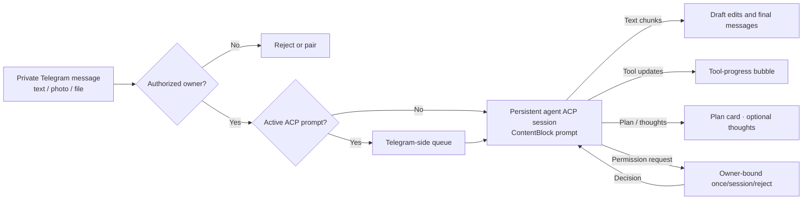

# Agent Telegram Bridge

<p align="center">
  
</p>

Run a local coding-agent session from a private Telegram chat. The bridge speaks the official [Agent Client Protocol (ACP)](https://agentclientprotocol.com) over stdio and supports two providers, selected with `AGENT_PROVIDER`:

- **`grok`** — xAI Grok Build via `grok agent --model grok-4.5 stdio`
- **`copilot`** — GitHub Copilot CLI via `copilot --acp --add-dir <cwd> --no-auto-update --no-remote --no-remote-export`

It does not expose an inbound HTTP server or Telegram webhook. Run one bridge instance per provider, each with its own bot token and state directory.

## Features

- **Secure by default**: private chats only, one numeric Telegram owner, expiring attempt-limited pairing codes, and atomic owner-only state files.
- **Multimodal prompts**: Linux downloads media into a descriptor-bound, owner-only inbox and exposes retained descriptors through `/proc`. macOS keeps media in an in-memory lease and sends only inline ACP image, audio, or embedded-resource blocks with opaque URNs; it never hands the agent a local attachment path. Agents that do not advertise a compatible inline capability receive a clear rejection on macOS.
- **Prompt queue**: text follow-ups while ACP is busy are queued in memory (default depth 3) instead of hard-rejected. The queue is intentionally volatile across restarts; media follow-ups must wait for the active prompt.
- **Interactive permissions**: choose **Allow once**, **Allow for session**, or the reject options offered by ACP. Resolved cards are replaced with their final status, and expired cards lose their buttons. Permissions are never approved automatically unless `AGENT_ALWAYS_APPROVE=true` (Grok prefers the session-scoped option; Copilot launches with `--allow-all`).
- **Streaming responses**: throttled draft edits, ordered multi-message final responses, typing indicators, tool-progress bubbles, progress notices, plan cards, optional thought stream (`/verbose`), and stall recovery buttons.
- **Single-poller protection**: a kernel-held ownership lock prevents competing bridge instances; PID, hostname, process-start token, and heartbeat metadata provide diagnostics.
- **Operational visibility**: `/status` and `health.json` report session, prompt, permission, queue, cwd, usage, and tool activity.
- **Child environment minimization**: the Telegram token is omitted from the agent subprocess environment, and sensitive values are redacted from permission summaries and logs. This is not an OS sandbox; see [Security model and limitations](#security-model-and-limitations).

## Requirements

- A supported host:
  - **Linux** with a mounted `/proc` filesystem, Python 3, `make`, and a C++ compiler
  - **macOS native preview** with Apple Command Line Tools and Python 3 for `node-gyp`; the project build compiles a small package-owned Node-API addon backed by `libproc`
  - **Windows through WSL2**; native Windows is intentionally rejected
- Node.js 24 or later
- One locally installed and authenticated agent CLI:
  - Grok CLI with access to the `grok-4.5` model, or
  - GitHub Copilot CLI with ACP support (`/usr/bin/copilot` by default on Linux, `copilot` from `PATH` on macOS, or set `AGENT_BIN`)
- A Telegram bot token from [@BotFather](https://t.me/BotFather)

On Debian or Ubuntu, install the native build prerequisites with `sudo apt-get install -y python3 make g++`. On macOS, use `xcode-select --install` and install Python 3 with Homebrew if `python3 --version` is unavailable. Validate with `python3 --version`, `make --version`, and `c++ --version` before `npm ci`.

The generated `dist/native/platform_security.node` is specific to the operating system and CPU architecture that built it. Run `npm ci` and `npm run build` on the deployment host. Do not copy `dist/native` or an `npm pack` tarball between Linux, macOS, ARM64, and x64 hosts. The source-build workflow requires development dependencies; `npm ci --omit=dev` cannot rebuild the addon.

`STATE_DIR` must be on a local filesystem with working advisory `flock` semantics. Do not place bridge state on NFS, SMB, cloud-sync folders, or other network filesystems.

The macOS implementation is security-gated in code and covered by cross-platform tests, but it has not yet been compiled or exercised on a real Mac from this project. Treat it as preview support until the native build, `proc_pidinfo`, launchd lifecycle, descendant teardown, lock recovery, ACP smoke, and Telegram attachment checks below pass on the target Mac.

## Quick start

1. Clone the repository and install dependencies:

   ```bash
   git clone https://github.com/DanWahlin/agent-telegram-bridge.git
   cd agent-telegram-bridge
   npm ci
   cp .env.example .env
   ```

2. Edit `.env`:

   ```dotenv
   TELEGRAM_BOT_TOKEN=your-bot-token
   AGENT_PROVIDER=grok
   AGENT_CWD=/absolute/path/to/the/project
   ```

   Set `AGENT_PROVIDER` to `grok` or `copilot`. `AGENT_CWD` is the directory the agent can inspect and modify. Use the narrowest practical project directory. Do not point it at the bridge installation or any directory containing `.env`, credentials, private keys, or unrelated repositories. Legacy `GROK_*` variable names are still accepted for Grok migration.

3. Start the bridge in development mode:

   ```bash
   npm run start:dev
   ```

4. Open a private chat with the bot and send a message. The one-time pairing code appears only in the bridge terminal. Send that code to the bot within five minutes.

5. Send a text prompt, photo, or document. The bridge keeps one persistent ACP session and processes one prompt at a time (with optional Telegram-side queue).

### Production start

Build the TypeScript output and run the compiled entry point:

```bash
npm run build
npm start
```

Run only one bridge process per bot token. Use one instance per provider (separate token and `STATE_DIR`). Use a process supervisor if the bridge must restart automatically.

### Linux systemd instance

The checked-in template runs one isolated service per provider/bot:

```bash
sudo install -o root -g root -m 0644 \
  deploy/systemd/agent-telegram@.service \
  /etc/systemd/system/agent-telegram@.service
sudo install -d -o root -g root -m 0700 /etc/agent-telegram
sudo install -o root -g root -m 0600 \
  deploy/systemd/copilot.env.example \
  /etc/agent-telegram/copilot.env
sudoedit /etc/agent-telegram/copilot.env
npm run build
sudo systemctl daemon-reload
sudo systemctl enable --now agent-telegram@copilot.service
```

The template assumes this repository is `/root/projects/agent-telegram-bridge` and runs as `root`; edit the unit for another path or service identity. Never start the legacy and shared bridges with the same Telegram token. Verify `health.json`, the ownership-lock PID, and the exact ACP child arguments after every cutover.

### macOS launchd instance

The build compiles `native/platform_security.cc` as a Node-API addon on Linux and macOS. The addon holds the singleton poller lock through a kernel `flock` on a persistent inode. On macOS, the bridge also loads and exercises its Darwin inspection code before starting any ACP child. That code calls `proc_pidinfo` directly to read microsecond-resolution process-start identity and current-directory vnode device/inode values in one bracketed inspection. It does not authorize from a pathname, `lsof`, or `ps` output.

Install Apple Command Line Tools if needed, then verify prerequisites:

```bash
xcode-select -p || xcode-select --install
/usr/bin/clang --version
python3 --version
node --version
command -v copilot   # or: command -v grok
```

Install, build the TypeScript and native addon, and create the owner-only dotenv file:

```bash
npm ci
npm run build
mkdir -p "$HOME/.config/agent-telegram" "$HOME/Library/LaunchAgents" "$HOME/Library/Logs"
cp deploy/launchd/copilot.env.example "$HOME/.config/agent-telegram/copilot.env"
chmod -N "$HOME/.config/agent-telegram/copilot.env"  # remove inherited ACL entries
chmod 600 "$HOME/.config/agent-telegram/copilot.env"
ls -le "$HOME/.config/agent-telegram/copilot.env"
```

Replace every placeholder in the environment file. Set `AGENT_BIN` to the result of `command -v copilot` or `command -v grok`. The LaunchAgent plist contains no token; the compiled launcher opens the dotenv file with `O_NOFOLLOW`, verifies owner/mode/link and descriptor identity, then parses it without invoking a shell.

Render and validate the plist from the repository root:

```bash
npm run render:launchd -- \
  --node "$(command -v node)" \
  --repo "$PWD" \
  --env "$HOME/.config/agent-telegram/copilot.env" \
  --home "$HOME" \
  --output "$HOME/Library/LaunchAgents/com.codewithdan.agent-telegram.copilot.plist"
plutil -lint "$HOME/Library/LaunchAgents/com.codewithdan.agent-telegram.copilot.plist"
```

Load and inspect the service:

```bash
launchctl bootout "gui/$(id -u)/com.codewithdan.agent-telegram.copilot" 2>/dev/null || true
launchctl bootstrap "gui/$(id -u)" \
  "$HOME/Library/LaunchAgents/com.codewithdan.agent-telegram.copilot.plist"
launchctl enable "gui/$(id -u)/com.codewithdan.agent-telegram.copilot"
launchctl print "gui/$(id -u)/com.codewithdan.agent-telegram.copilot"
```

Logs are written under `~/Library/Logs/`. Before calling a Mac deployment verified, run the full test suite and `npm run smoke`, send a real Telegram prompt and attachment, then confirm `health.json` returns to `activePrompt: null` and `likelyState: healthy/idle`.

### Current Copilot deployment on this host

The production Copilot bot uses this shared bridge:

| Item | Value |
| --- | --- |
| Repository | `/root/projects/agent-telegram-bridge` |
| Service | `agent-telegram@copilot.service` |
| Unit template | `/etc/systemd/system/agent-telegram@.service` |
| Secret environment | `/etc/agent-telegram/copilot.env` (`0600`; never print or commit) |
| Runtime state | `/var/lib/agent-telegram/copilot` |
| Agent workspace | `/root/projects/ZenSquirrel` |
| Provider command | `copilot --acp --add-dir /root/projects/ZenSquirrel --no-auto-update --no-remote --no-remote-export` |
| Legacy rollback service | `copilot-cli-telegram.service` (disabled) |

Copilot intentionally receives no `--model` argument, so it uses the account/default model. The systemd template owns the bridge, ACP child, and MCP descendants as one control group.

Check production without exposing the bot token:

```bash
systemctl status agent-telegram@copilot.service --no-pager
systemctl show agent-telegram@copilot.service \
  -p MainPID -p NRestarts -p ControlGroup --no-pager
journalctl -u agent-telegram@copilot.service -n 150 --no-pager
```

After a completed prompt, `/var/lib/agent-telegram/copilot/health.json` must report:

```text
connected: true
activePrompt: null
reason: prompt-idle
likelyState: healthy/idle
```

Also verify that `lock.json` points to the live systemd `MainPID`, the Copilot child has no `--model` argument, and no legacy extension poller is running.

Rollback only if the shared service cannot be recovered:

```bash
sudo systemctl disable --now agent-telegram@copilot.service
sudo systemctl enable --now copilot-cli-telegram.service
```

Never run both services with the same bot token. The original cutover backup is `/root/backups/agent-telegram-cutover-20260719T222103Z`.

## Telegram commands

| Command | Behavior |
| --- | --- |
| `/start`, `/help` | Show usage and pairing guidance |
| `/status` | Bridge, ACP, queue, cwd, usage, and activity status |
| `/new` | Stop the current agent subprocess, clear queued prompts, and create a fresh ACP session |
| `/cancel` | Cancel the active ACP prompt (waits for idle) |
| `/cancel queue` | Cancel active prompt if any, and clear the follow-up queue |
| `/retry last` | Re-send the last final text response (no agent re-run) |
| `/verbose on\|off` | Toggle ACP thought-stream visibility |
| `/cwd` | List allowlisted working directories |
| `/cwd <n\|path>` | Switch CWD (allowlist only) and restart the ACP session |

Any other message text is forwarded as a prompt.

## Configuration

Copy `.env.example` to `.env`. Primary settings:

| Variable | Default | Purpose |
| --- | --- | --- |
| `TELEGRAM_BOT_TOKEN` | Required | Token issued by @BotFather |
| `AGENT_PROVIDER` | `grok` | Coding agent to bridge: `grok` or `copilot` |
| `AGENT_CWD` | Current directory | Working directory available to the agent |
| `AGENT_CWD_ALLOWLIST` | (primary only) | Comma-separated paths allowed for `/cwd` |
| `AGENT_BIN` | `grok` / `/usr/bin/copilot` | Agent executable path (provider default; common Grok user locations are also detected) |
| `AGENT_MODEL` | `grok-4.5` | Model passed to `grok agent`. Ignored for Copilot (never sent a `--model`) |
| `AGENT_DISPLAY_NAME` | provider default | Name shown in help, permission cards, and errors |
| `STATE_DIR` | `./.agent-telegram-state` | Directory for access, lock, and health state |
| `AGENT_ALWAYS_APPROVE` | `false` | Auto-approve ACP permissions (Grok prefers session-scoped; Copilot uses `--allow-all`) |
| `PAIRING_PENDING_MAX` | `100` | Maximum simultaneous unpaired chat challenges |
| `MEDIA_MAX_BYTES` | `20971520` | Max attachment size (20 MiB) |
| `MEDIA_MIME_ALLOWLIST` | images/audio/video/pdf/text… | Comma-separated MIME allowlist |
| `PROMPT_QUEUE_MAX` | `3` | Follow-up queue depth while busy (`0` = reject) |
| `TELEGRAM_OUTBOUND_QUEUE_MAX` | `100` | Maximum queued Telegram API operations |
| `TELEGRAM_RETRY_MAX` | `5` | Rate-limit retries per Telegram operation (`0`–`5`) |
| `API_TIMEOUT_MS` | `30000` | Per-operation API and ACP setup timeout (maximum `30000`) |
| `ASSISTANT_TEXT_MAX_CHARS` | `200000` | Maximum assistant text retained for one response |
| `CANCEL_WAIT_MS` | `15000` | Wait for ACP idle after cancel (maximum `30000`) |
| `RETRY_LAST_TTL_MS` | `1800000` | How long `/retry last` keeps the last response |
| `PROGRESS_NOTICE_AFTER_MS` | `90000` | First “still working” notice (mobile-friendly default) |
| `VERBOSE_DEFAULT` | `false` | Start with thought stream enabled |

Legacy `GROK_CWD`, `GROK_CWD_ALLOWLIST`, `GROK_BIN`, `GROK_MODEL`, and `GROK_ALWAYS_APPROVE` names remain accepted for Grok migration; the `AGENT_*` names take precedence.

`.env.example` documents all optional runtime limits and timing controls for pairing, permissions, streaming, typing, progress notices, health writes, API calls, and outbound pacing.

## How it works



- `grammY` long-polls Telegram. No webhook endpoint is opened.
- Prompts are serialized to ACP. Follow-ups enqueue on the Telegram side.
- On Linux, attachments land in `<CWD>/.tg-inbox/` (directory mode `0700`, active file mode `0600`). On macOS, attachments remain in memory and are sent only through compatible inline ACP blocks.
- Assistant output is HTML-escaped, rendered from a limited Markdown subset, and split at Telegram's message limit.
- Tool and permission controls are sent only to the authorized chat that owns the active prompt.
- Outbound Telegram operations share one paced queue with retry handling for rate limits.

## Runtime state

The bridge creates these files under `STATE_DIR`:

| File | Contents |
| --- | --- |
| `access.json` | Authorized user ID and temporary pairing state |
| `lock.json` | Human-readable poller ownership metadata |
| `lock.json.ownership` | Persistent regular file whose open descriptor holds the kernel `flock` singleton lease |
| `health.json` | Current bridge, Telegram, ACP, prompt, and permission status |

The state directory is forced to mode `0700` and state files to `0600`. Do not commit or share them.

On Linux, inbox files for media live under `<session CWD>/.tg-inbox/` (not `STATE_DIR`). The inbox is forced to mode `0700`. After a prompt settles, the bridge erases each admitted opened file, removes its permissions, and closes its retained descriptor without unlinking a reusable pathname. Empty retired entries can remain, and an abrupt process death can leave an admitted file intact; inspect and remove leftovers only while the bridge is stopped.

That disk-backed inbox is Linux-only. macOS retains attachment bytes in memory, uses `urn:agent-telegram:sha256:<digest>` identifiers, and zeroes the retained buffer during cleanup. It never emits `/proc`, `/dev/fd`, `file://`, a workspace path, or a fallback `resource_link` for a macOS attachment.

Buffer zeroing retires the bridge-owned macOS lease. Base64 or text copies already created inside V8 or the ACP SDK cannot be guaranteed to be overwritten before garbage collection.

## Security model and limitations

- The first successfully paired Telegram user becomes the only owner. Pairing closes after that.
- Commands, prompts, callbacks, and permission decisions are accepted only from the owner in a private chat.
- Pairing codes expire and allow at most five attempts.
- The agent subprocess receives an explicit environment allowlist and does not inherit `TELEGRAM_BOT_TOKEN`.
- Environment filtering is not a sandbox. An agent process running as the same operating-system user may read any file that user can access, including bridge configuration if filesystem permissions allow it. Keep the bridge installation and secrets outside `AGENT_CWD`; use a separate execution identity or sandbox when the agent must not share that trust boundary.
- ACP permission decisions are bound to the active request, owner, and chat.
- `AGENT_ALWAYS_APPROVE=true` removes the interactive safety boundary. Leave it disabled unless the agent and working directory are fully trusted.
- Media ingress enforces MIME allowlists and size caps. Automatic outbound local-file delivery is disabled until ACP exposes a narrow artifact contract.
- One bridge supports one owner, one agent subprocess, and one active ACP prompt at a time. Run separate instances (distinct bot tokens and `STATE_DIR`) for different providers.
- Use a least-privilege operating-system account and a narrowly scoped `AGENT_CWD`.
- `/cwd` can only switch among `AGENT_CWD` and `AGENT_CWD_ALLOWLIST` paths that exist on disk.

## Troubleshooting

**The bot reports another poller or exits with a conflict**

Another process is using the same bot token. Stop the other process before restarting this bridge. Do not delete or replace `lock.json.ownership` while a bridge process is running. The kernel releases its advisory lock automatically when the owner exits or crashes; normal recovery never deletes the lock file.

**No pairing code appears in Telegram**

The code is intentionally printed only in the bridge terminal. Send any message to the bot in a private chat, then check the terminal output.

**The agent does not connect**

Confirm that `AGENT_BIN` points to a working CLI, the CLI is already authenticated, `AGENT_CWD` exists, and the provider's ACP command works locally:

```bash
# Grok
grok agent --model grok-4.5 stdio

# GitHub Copilot CLI
copilot --acp --add-dir /absolute/path/to/the/project --no-auto-update --no-remote --no-remote-export
```

When `AGENT_ALWAYS_APPROVE=true`, the bridge starts the production child with the exact command:

```bash
# Grok
grok agent --model grok-4.5 --always-approve stdio

# GitHub Copilot CLI (no --model is ever added)
copilot --acp --add-dir /absolute/path/to/the/project --no-auto-update --no-remote --no-remote-export --allow-all
```

**A prompt appears stalled**

Use `/status` and inspect `STATE_DIR/health.json`. The watchdog reports inactivity after `PROMPT_STALE_AFTER_MS` and offers **Cancel** / **Keep waiting** buttons.

**Attachment rejected**

Check `MEDIA_MAX_BYTES` and `MEDIA_MIME_ALLOWLIST`. Oversized or disallowed MIME types are refused before ACP sees them.

**Final message missing after a long run**

If delivery failed, try `/retry last` within `RETRY_LAST_TTL_MS` to re-send the last stored response without re-running the agent.

## Development

```bash
npm run typecheck
npm run lint
npm test
npm run build
npm audit
```

`npm run build` runs `npm run clean` first because TypeScript does not remove JavaScript for deleted source files. This prevents stale modules from entering `dist` or the package. The guarded clean removes only generated `dist` output and refuses to run when `STATE_DIR` or `AGENT_CWD` resolves inside `dist`, including through a symlink, so cleanup cannot erase runtime identity or an active media workspace.

Inspect the exact package contents before a release:

```bash
npm pack --dry-run
```

Run the live ACP-only smoke test when a working agent CLI is available. It selects the provider from `AGENT_PROVIDER`:

```bash
npm run smoke
```

See [`AGENTS.md`](AGENTS.md) for repository structure, security invariants, testing guidance, and contributor expectations.

## Reporting security issues

Use the repository's private **Report a vulnerability** flow as described in [`SECURITY.md`](SECURITY.md). Do not disclose suspected vulnerabilities, tokens, private prompts, or runtime state in a public issue.

## License

[MIT](LICENSE)
